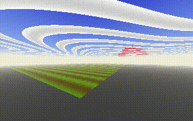

# playme.md
Explore an interactive 3D world within your GitHub's readme.md!



## Dependencies
- FFmpeg
- Some C compiler
- libc

## Building
Run the ```build.sh``` files located in both program folders. Example with POSIX-compliant shell:
```
sh build.sh
sh asahi_renderer/build.sh
```

## Execution
Now just run the server with:
```
./serve
```

# Extra
The bin folder contains Heroku-related binaries. Yes, this runs on Heroku, just connect the repository and go.